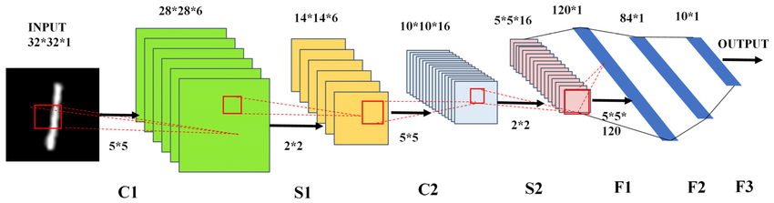

# 🧠 CIFAR-10 Image Classifier with LeNet (PyTorch + Streamlit)

This project demonstrates a simple image classifier trained on the [CIFAR-10 dataset](https://www.cs.toronto.edu/~kriz/cifar.html) using a LeNet-style Convolutional Neural Network built with PyTorch. A Streamlit web app is used to deploy the model for real-time image prediction.



---

## 🚀 Features

- Custom CNN model (LeNet-style) trained from scratch
- Real-time prediction of uploaded images via Streamlit
- Pretrained on CIFAR-10 (10 object categories)
- Web interface to visualize predictions and confidence
- Educational illustration of CNN internals and code

---

## 🗂️ Dataset

[CIFAR-10](https://www.cs.toronto.edu/~kriz/cifar.html):  
Contains 60,000 32x32 color images in 10 classes, with 6,000 images per class.

Classes include:
airplane, automobile, bird, cat, deer, dog, frog, horse, ship, truck

---
## 📦 Installation

1. **Clone the repository**
```bash
git clone https://github.com/plum-berry/Convolution-neural-net
cd Convolution-neural-net
```
2. **Install dependencies**
```bash
pip install -r requirements.txt
```
3. **Run the Streamlit app**
```bash
streamlit run app.py
```
---
## 🖼️ Example
1. Upload an image (.jpg,.jpeg, or .png)
2. The app will:
    - Display the uploaded image
    - Predict the class label
